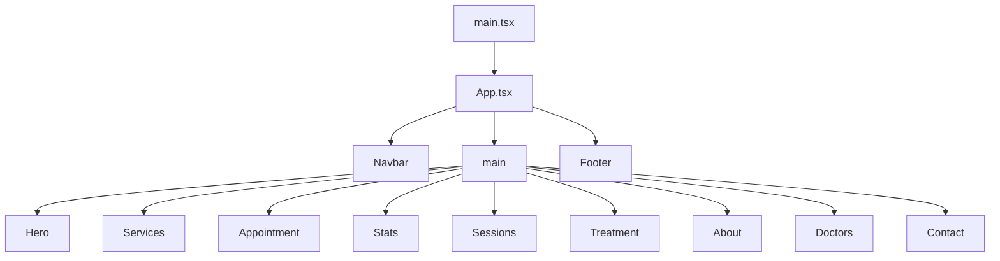
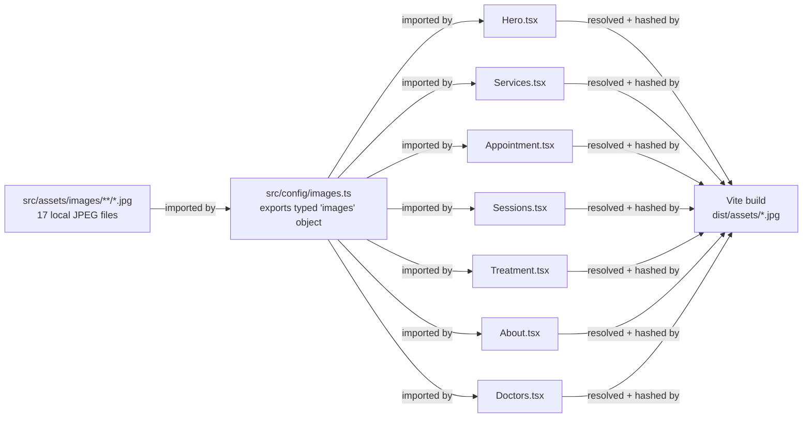

<div align="center">

# CareSync

**A modern medical landing page that turns a clinic's online presence into a live, animated experience.**

[](https://react.dev)
[](https://www.typescriptlang.org)
[](https://tailwindcss.com)
[](https://www.framer.com/motion)
[](https://vitejs.dev)

CareSync is a fully responsive, offline-capable healthcare landing page built with React 18, TypeScript, Tailwind CSS, and Framer Motion. It covers the full patient journey — from a hero with live availability status through service listings, appointment booking, doctor profiles, and a contact form — with scroll-triggered animations throughout.

</div>

---

## Overview

Clinics and medical practices often rely on static HTML templates that look dated and feel disconnected. CareSync solves that by providing a structured, animated single-page experience that:

- **Converts visitors** through a prominent booking form and clear service descriptions
- **Builds trust** with real doctor profiles, clinic statistics, and a custom treatment section
- **Works anywhere** — all 17 images are stored as local project assets; the site functions without an internet connection

**Target audience:** developers who want a production-ready medical landing page they can fork, customise, and deploy.

---

## Features

- **Full-viewport hero** with a background clinic image, gradient overlay, staggered text animations, and a pulsing 24/7 availability badge
- **Services grid** — 6 cards (General Checkup, Surgery, Dental Care, Laboratory, Primary Care, Chronic Disease) with hover lift and image zoom
- **Appointment booking form** with Full Name, Phone, Email, Doctor selector, Date picker, Time selector, and terms checkbox
- **Animated stats banner** — count-up numbers (15+, 50+, 10k+, 24/7) triggered when the section enters the viewport
- **Medical Sessions section** — 3 consultation cards (In-Person $50, Heart Treatment $120, Follow-up $30) with per-card type badges
- **Custom Treatment section** — animated checklist with staggered entry per item
- **About section** — clinic mission text, four feature highlight cards, and a stacked doctor avatar group
- **Doctor cards** — four profiles (rating, review count) with social-link overlay on hover
- **Contact section** — address/phone/email/hours panel, embedded Google Maps iframe, and a full contact form
- **Sticky navbar** — transparent over the hero, transitions to frosted-glass (`bg-white/95 backdrop-blur-md`) on scroll; collapses to an animated hamburger on mobile
- **Footer** — three link columns (Company, Services, Support), social icons, back-to-top button
- **Fully offline** — zero runtime image fetches; all 17 JPEGs bundled via Vite at build time

---

## UI Highlights

### Design System

Two reusable Tailwind component classes are defined in `src/index.css`:

```css
.section-badge   /* pill label above every section heading */
.card-hover      /* lift + shadow on card interaction */
```

Every section heading follows the same three-element pattern: badge → `h2` (Playfair Display) → description paragraph.

### Typography

| Role | Family | Weights |
|---|---|---|
| Body / UI | Inter | 300, 400, 500, 600, 700 |
| Section headings, hero H1 | Playfair Display | 600, 700 |

Both fonts are loaded from Google Fonts in `index.html`.

### Colour Palette

The single custom colour scale added on top of Tailwind's defaults:

| Token | Hex | Usage |
|---|---|---|
| `primary-50` | `#f0f9ff` | Badge backgrounds |
| `primary-100` | `#e0f2fe` | — |
| `primary-400` | `#38bdf8` | Hero accent, nav hover |
| `primary-500` | `#0ea5e9` | CTA buttons, stats banner, navbar logo |
| `primary-600` | `#0284c7` | Button hover, link text |
| `primary-700` | `#0369a1` | — |

### Responsive Strategy

Three layout breakpoints via Tailwind's default scale:

| Breakpoint | Width | Key changes |
|---|---|---|
| default (mobile) | < 640 px | Single-column layout, hamburger nav, 2-col stats grid |
| `sm:` | ≥ 640 px | 2-column form grids, emergency badge visible, 2-col card grids |
| `lg:` | ≥ 1024 px | 3-col service/sessions grids, 4-col doctor grid, side-by-side sections, desktop nav |

### Animations

All motion is handled by Framer Motion. No CSS `@keyframes` are used.

| Element | Technique | Detail |
|---|---|---|
| Navbar | `motion.header` mount | Slides from `y: -80` to `y: 0` on load |
| Hero text | `variants` + `custom` index | Staggered `fadeUp` at 0.15 s × item index |
| Emergency badge | mount + infinite | Scale-in on load; `scale: [1, 1.3, 1]` pulse loop at 1.6 s |
| Scroll indicator | infinite | `y: [0, 8, 0]` bounce at 1.5 s |
| Section cards | `useInView` | `opacity: 0 → 1`, `y: 50 → 0` when section enters viewport (`once: true`) |
| Stats numbers | `CountUp` component | Increments from 0 to target over 1800 ms at ~60 fps using `setInterval(16)` |
| Mobile menu | `AnimatePresence` | Height animates from 0 to `'auto'` on open; reverses on close |
| Doctor photo overlay | Tailwind `group-hover` | `opacity-0 → opacity-100`, social icons animate in with Framer `whileHover` |
| Form submit button | `whileTap` | `scale: 0.98` press feedback; colour transitions to green on success |
| Slide-in sections | `useInView` | Appointment, Treatment, About, Contact slide from `x: ±50` |

### Component Architecture

Each component is a default-export function in `src/components/`. There is no shared state or context — components are fully self-contained. All image paths flow through `src/config/images.ts`; no component imports an image file directly.

---

## Tech Stack

| Layer | Library / Tool | Version |
|---|---|---|
| UI framework | React | 18.3.1 |
| Language | TypeScript | 5.2.2 |
| Build tool | Vite | 5.3.4 |
| Styling | Tailwind CSS | 3.4.7 |
| Animation | Framer Motion | 11.3.19 |
| Icons | Lucide React | 0.395.0 |
| CSS post-processing | PostCSS + Autoprefixer | 8.4.40 / 10.4.19 |

---

## Folder Structure

```
CareSync/
├── index.html                    # Entry HTML; title, viewport, Google Fonts
├── vite.config.ts                # Vite + @vitejs/plugin-react
├── tailwind.config.js            # Custom fonts (Inter, Playfair Display) + primary colour scale
├── postcss.config.js             # tailwindcss + autoprefixer
├── tsconfig.json                 # Strict TS, bundler module resolution
├── tsconfig.node.json            # TS config for vite.config.ts
├── package.json
└── src/
    ├── main.tsx                  # ReactDOM.createRoot entry point
    ├── App.tsx                   # Root component — composes all 11 sections
    ├── index.css                 # Tailwind directives + .section-badge / .card-hover
    ├── vite-env.d.ts             # /// <reference types="vite/client" /> + *.jpg declarations
    ├── config/
    │   └── images.ts             # Single source of truth for all image paths
    ├── assets/
    │   └── images/               # 17 local JPEG assets (no remote URLs at runtime)
    │       ├── hero/             # clinic-interior.jpg
    │       ├── services/         # general-checkup, surgery, dental-care,
    │       │                     #   laboratory, primary-care, chronic-disease
    │       ├── appointment/      # doctor-portrait.jpg
    │       ├── sessions/         # in-person, heart-treatment, follow-up
    │       ├── treatment/        # consultation.jpg
    │       ├── about/            # clinic-team.jpg
    │       └── doctors/          # sarah-johnson, mark-williams,
    │                             #   emily-chen, ahmed-hassan
    └── components/
        ├── Navbar.tsx            # Sticky header, scroll state, mobile menu
        ├── Hero.tsx              # Full-screen section, staggered entry
        ├── Services.tsx          # 6-card grid
        ├── Appointment.tsx       # Booking form + doctor portrait
        ├── Stats.tsx             # Count-up banner
        ├── Sessions.tsx          # 3 consultation cards with pricing
        ├── Treatment.tsx         # Custom treatment checklist
        ├── About.tsx             # Clinic mission + feature highlights
        ├── Doctors.tsx           # 4 doctor profile cards
        ├── Contact.tsx           # Map + contact form
        └── Footer.tsx            # Links, social icons, back-to-top
```

---

## Installation

```bash
git clone https://github.com/elsayedrefaat/CareSync.git
cd CareSync
npm install
```

**Node.js ≥ 18** is required. No other system dependencies.

---

## Running Locally

```bash
npm run dev
```

Open [http://localhost:5173](http://localhost:5173). Vite serves with HMR.

---

## Build

```bash
npm run build
```

Output goes to `dist/`. Preview the production bundle locally:

```bash
npm run preview
```

---

## Environment Variables

This project uses **no environment variables**. There are no `.env` files and no `import.meta.env` references in the source. All configuration (fonts, colours, content) is compiled into the bundle at build time.

---

## Architecture

### Component Hierarchy



### Image Data Flow



---

## Performance

Numbers from `npm run build` (Vite 5.4.21):

| Asset | Raw size | Gzipped |
|---|---|---|
| `index.html` | 0.64 kB | 0.41 kB |
| `index-*.css` | 23.71 kB | **4.85 kB** |
| `index-*.js` | 304.64 kB | **94.20 kB** |

**Images bundled into `dist/assets/`:**

| Image | Size |
|---|---|
| `clinic-interior.jpg` (hero bg) | 274 kB |
| `doctor-portrait.jpg` (appointment) | 2,776 kB |
| `surgery.jpg` | 79 kB |
| `clinic-team.jpg` | 55 kB |
| `chronic-disease.jpg` | 49 kB |
| `consultation.jpg` | 48 kB |
| `primary-care.jpg` | 45 kB |
| `in-person.jpg` | 39 kB |
| `follow-up.jpg` | 40 kB |
| `dental-care.jpg` | 34 kB |
| `emily-chen.jpg` | 34 kB |
| `general-checkup.jpg` | 33 kB |
| `heart-treatment.jpg` | 31 kB |
| `sarah-johnson.jpg` | 30 kB |
| `laboratory.jpg` | 27 kB |
| `mark-williams.jpg` | 15 kB |
| `ahmed-hassan.jpg` | 14 kB |

**Notes:**
- All 17 images are fingerprinted (`clinic-interior-BowXznWU.jpg`) and served with long-term cache headers when deployed behind a CDN
- The appointment doctor portrait (`doctor-portrait.jpg`, 2.8 MB) is the largest asset and is a candidate for conversion to WebP
- The Google Maps iframe uses `loading="lazy"` — it only loads when the contact section is visible
- No code splitting is configured; the entire application ships as a single JS chunk
- No tree-shaking of Lucide icons beyond what TypeScript's `isolatedModules` enables via Vite's bundler

---

## Accessibility

Implemented accessibility features found in the source:

- **`<html lang="en">`** — language declared in `index.html`
- **`aria-label="Toggle menu"`** — on the mobile hamburger `<button>` in `Navbar.tsx`
- **`alt` attributes** — set on every `` element (e.g. `"Modern clinic interior"`, doctor names)
- **Semantic HTML** — `<header>`, `<main>`, `<section>`, `<nav>`, `<footer>`, `<form>`, `<label>` elements used throughout
- **`<label>` elements** — every form input in `Appointment.tsx` and `Contact.tsx` has an explicit `<label>`
- **Input types** — `type="email"`, `type="tel"`, `type="date"` used for correct mobile keyboard and browser validation
- **`required` attributes** — on Full Name, Message, and Email fields; browser-native validation fires before submit
- **`scroll-behavior: smooth`** — applied globally in `index.css`; anchor links animate instead of jump
- **`iframe title="CareSync Location"`** — the Google Maps embed has a descriptive title
- **`loading="lazy"`** on the Maps `<iframe>` — defers off-screen network request

---

## SEO

From `index.html`:

```html
<html lang="en">
<meta charset="UTF-8" />
<meta name="viewport" content="width=device-width, initial-scale=1.0" />
<title>CareSync – Trusted Medical Care</title>
```

**Not implemented:** `<meta name="description">`, Open Graph tags, Twitter Card tags, canonical URL, structured data (`application/ld+json`), sitemap. These are realistic next improvements.

---

## Documentation

There is no `/docs` directory in this repository. All documentation is in this file.

---

## Future Improvements

Based on the current implementation, realistic next steps are:

1. **Convert `doctor-portrait.jpg` to WebP** — it is 2.8 MB and the single largest performance bottleneck
2. **Add `<meta name="description">` and Open Graph tags** to `index.html`
3. **Wire the appointment and contact forms to a backend** — currently both forms display a UI success state but do not send data anywhere
4. **Add a `<meta name="theme-color">` tag** matching `primary-500` (`#0ea5e9`) for browser chrome on mobile
5. **Configure Vite's `build.rollupOptions.output.manualChunks`** to split React + Framer Motion into a separate vendor chunk
6. **Lazy-load below-the-fold images** using the native `loading="lazy"` attribute on `` tags in Services, Sessions, About, and Doctors sections
7. **Add `focus-visible` ring styles** to interactive elements for full keyboard-navigation support
8. **Internationalise** — the content (English only) and form (`dir="ltr"`) would need RTL support for Arabic-speaking markets

---

## Author

**elsayedrefaat** · [github.com/elsayedrefaat](https://github.com/elsayedrefaat)

Repository: [github.com/elsayedrefaat/CareSync](https://github.com/elsayedrefaat/CareSync)

---

## License

No license is declared in this repository.
